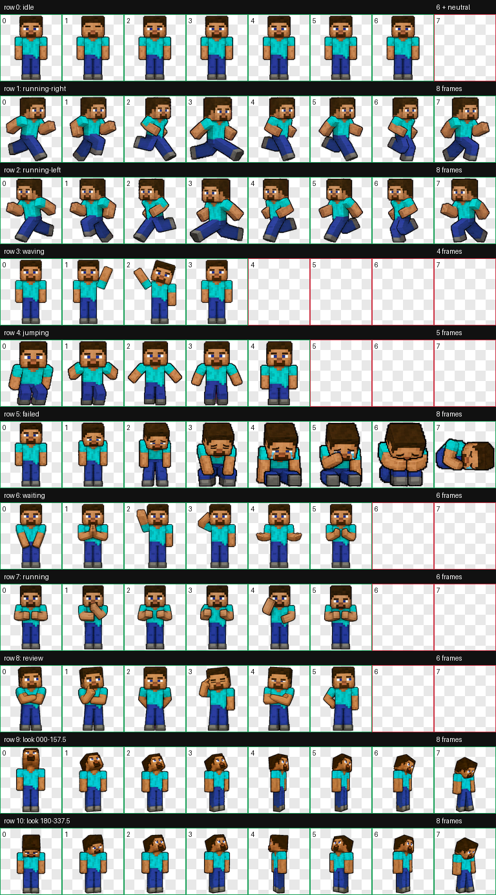

# Minecraft Steve Codex Pet

Unofficial fan-made Codex pet assets based on Minecraft Steve.



This repository contains the working files used to generate, review, and validate a v2 Codex pet atlas for Steve: source prompts, reference material, decoded row strips, extracted frames, QA artifacts, and final spritesheets.

## Canonical asset

The primary release artifact in this repository is:

- `final/spritesheet-extended.webp`

That file is the validated v2 atlas:

- `1536 x 2288`
- `8` columns by `11` rows
- `192 x 208` per cell
- standard action rows plus `16` look directions

Supporting metadata for the v2 atlas lives in:

- `final/spritesheet-extended.json`
- `final/validation-extended.json`

The older `final/spritesheet.webp` and `final/spritesheet.png` are legacy 9-row outputs and should not be treated as the install target for this repo's current version.

## Animation layout

Rows `0` through `8` are the standard Codex pet actions:

1. `idle`
2. `running-right`
3. `running-left`
4. `waving`
5. `jumping`
6. `failed`
7. `waiting`
8. `running`
9. `review`

Rows `9` and `10` provide clockwise look directions:

- row `9`: `0` through `157.5` degrees
- row `10`: `180` through `337.5` degrees

## Manual install

Codex pets are installed as:

```text
~/.codex/pets/<pet-id>/
├── pet.json
└── spritesheet.webp
```

To install this pet manually:

1. Create `~/.codex/pets/steve/`.
2. Copy `final/spritesheet-extended.webp` to `~/.codex/pets/steve/spritesheet.webp`.
3. Create `~/.codex/pets/steve/pet.json` with:

```json
{
  "id": "steve",
  "displayName": "Steve",
  "description": "A blocky pixel adventurer inspired by Minecraft Steve.",
  "spriteVersionNumber": 2,
  "spritesheetPath": "spritesheet.webp"
}
```

## Repository layout

- `decoded/` generated strip images for each row and look-direction pass
- `final/` validated final atlases and atlas metadata
- `frames/` extracted per-frame PNGs used for review and packaging work
- `prompts/` base, row, retry, and look-repair prompts used during generation
- `qa/` contact sheets, previews, direction checks, and review JSON
- `references/` canonical identity art and layout guides
- `pet_request.json` high-level pet specification
- `imagegen-jobs.json` generation job log and dependency graph

## QA and review artifacts

The repo keeps the evidence used to approve the final atlas, including:

- `qa/contact-sheet-extended.png`
- `qa/look-directions.png`
- `qa/look-continuity.json`
- `qa/direction-blind-validation.json`
- `qa/review.json`

If you change the atlas, update the relevant QA artifacts in the same change so the repo stays auditable.

## Fan project note

This is an unofficial fan work inspired by Minecraft Steve. Minecraft, Steve, and related trademarks and character rights belong to Mojang Studios and Microsoft.
